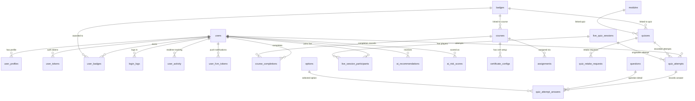

# V1 Codebase Analysis for V2 Development

## 1. Core User Roles
The original V1 system operates around **four core roles**, each mapped to specific frontend portal directories and validated within the application:

1. **Admin (`admin`)**
   * **Directory**: `/admin`
   * **Purpose**: System diagnostics, audit/error logging, impersonation, master data management (users, departments, designations, stores), settings, static pages, and data purging.
2. **Trainer (`trainer`)**
   * **Directory**: `/trainer`
   * **Purpose**: Course and quiz curation, badge management, assignment tracking, reporting/analytics, live session hosting, milestone configuration, and AI-enabled curation tools.
3. **Participant (`participant`)**
   * **Directory**: `/participant`
   * **Purpose**: View/study courses, take quizzes, run interactive AI roleplays, view badges/rewards, check leaderboards, and manage assigned tasks.
4. **Manager / Area Manager (`area_manager`)**
   * **Directory**: `/area_manager`
   * **Purpose**: Oversee tasks and leaderboard statistics. 
   * *Role-Switching Mechanism*: When an `area_manager` visits any `/participant/` portal page, their active session role temporarily switches to `participant` so they can view and experience courses firsthand.

---

## 2. V1 API Structure & Routing Mechanism

APIs under the `/api` directory are structured in a hybrid fashion in V1:

### Direct File-Based Endpoints (Primary)
The majority of endpoints are standalone PHP scripts organized into domain-specific subdirectories under `/api`:
* **Auth**: `/api/auth/login.php`, `/api/auth/me.php`, `/api/auth/logout.php`
* **Courses**: `/api/courses/list.php`, `/api/courses/detail.php`, `/api/courses/save_progress.php`
* **Quizzes**: `/api/quizzes/list.php`, `/api/quizzes/submit.php`, `/api/quizzes/submit_live_answer.php`
* **Other Features**: `/api/dashboard.php`, `/api/leaderboard.php`, `/api/tasks/`

These endpoints load the core environment by immediately requiring `api/helpers/api_bootstrap.php`, which handles CORS headers, exception/error handlers, database connections, and role-based authentication (`require_participant()` and `require_trainer()`).

### Rewrite-Based Front Controller (For `api/v1/*` routes)
As configured in `.htaccess`:
```apache
RewriteCond %{REQUEST_FILENAME} !-f
RewriteCond %{REQUEST_FILENAME} !-d
RewriteRule ^api/v1/(.*)$ api/index.php?route=$1 [QSA,L]
```
* Requests sent to `/api/v1/<route>` that do not match a physical file/folder on disk are routed dynamically to the front controller at `api/index.php`.
* In version 1, this router parses the path parameter and maps the resource using a basic routing table. Currently, only `'static_pages'` is registered:
  ```php
  $routes = [
      'static_pages' => [
          'controller' => 'StaticPagesController',
          'action' => 'list'
      ]
  ];
  ```
* The routed request executes dynamically via `api/helpers/StaticPagesController.php`.

---

## 3. Security, Authentication & Sessions

### Passwords & Brute-Force Protection
* **Password Hashing**: Passwords are fundamentally secured using PHP's native bcrypt implementation (`password_hash` & `password_verify`).
* **Brute-Force Protection**: The login API tracks failed attempts using the `login_attempts` table. It enforces a strict lockout policy: if a user fails to log in 5 times within 5 minutes from the same IP address and username, the account is temporarily locked out.
* **First Login Enforcement**: Users logging in for the first time have an `is_first_login` database flag set to `true`. On the web portal, this forces a redirect to `change_password.php`. In the API, this results in a `FIRST_LOGIN_REQUIRED` error.

### Session Handling Architecture
The system employs a dual-strategy for state management:

* **Web Portal (PHP Native Sessions)**: The web frontend relies heavily on native PHP sessions (`$_SESSION`). Data like `user_id`, `user_role`, `full_name`, and a cached `profile_pic` are kept in session memory to reduce database queries.
* **Mobile App (Bearer Tokens)**: Mobile devices use long-lived cryptographic tokens instead of cookies. 
  * Upon successful login, the server generates a 32-byte secure random string (`bin2hex(random_bytes(32))`).
  * The raw string is returned to the client, while a SHA-256 hash of this string is stored in the `user_tokens` database table with a 5-year expiration (`expires_at`).
  * The client must pass this raw token in the `Authorization: Bearer <token>` header for all subsequent API calls.

---

## 4. API Payload Structures

### A. Login Endpoint (`POST /api/auth/login.php`)

**Expected Request Payload (JSON or Form Data):**
```json
{
  "username": "johndoe",
  "password": "securepassword123",
  "app_version": "1.0.5" 
}
```

**Success Response (200 OK):**
```json
{
  "success": true,
  "token": "a1b2c3d4e5f6g7h8i9j0k1l2m3n4o5p6q7r8s9t0u1v2w3x4y5z6a7b8c9d0e1f2",
  "expires_at": 1878939234,
  "user": {
    "id": 123,
    "username": "johndoe",
    "full_name": "John Doe",
    "email": "johndoe@example.com",
    "role": "participant",
    "is_first_login": false
  }
}
```

### B. Profile Endpoint (`GET /api/auth/me.php`)

**Expected Request Headers:**
```http
Authorization: Bearer <raw_hex_string_token>
```

**Success Response (200 OK):**
```json
{
  "success": true,
  "user": {
    "id": 123,
    "username": "johndoe",
    "full_name": "John Doe",
    "email": "johndoe@example.com",
    "phone": "9876543210",
    "designation": "Sales Associate",
    "department": "Retail",
    "role": "participant",
    "is_first_login": false
  }
}
```

---

## 5. Database Schema & ERD

### Architecture Highlights
- **Cloud Storage via OCI**: Assets (roleplay videos, course thumbnails, profile pictures, badges) are stored in Oracle Cloud Infrastructure Object Storage. Paths in the database (e.g., `video_path`, `icon_path`) map to OCI URLs via `oci_helper.php`.
- **Foreign Keys constraints**: Extensive use of `ON DELETE CASCADE` ensures clean deletion of users and courses.

### Entity-Relationship Diagram (ERD)



### Core Schema Details

#### 1. Identity & Access Management
*   **`users`**: The foundational identity table (assumed core fields: id, username, password, role, is_first_login).
*   **`user_profiles`**: Extended user data. Includes `full_name`, `mobile_number`, `store_code`, `designation`, `department`, `profile_pic`, `android_app_version`, `last_app_ping`.
*   **`user_tokens`**: Stores `token_hash` for mobile app Bearer token authentication (expires in 5 years).
*   **`login_attempts`**: IP and username tracking to prevent brute-force attacks.
*   **`password_resets`**: Stores hashed tokens for password recovery.
*   **`user_fcm_tokens`**: Tracks device tokens for Push Notifications.

#### 2. Gamification & Achievements
*   **`badges`**: Defines badges (`name`, `icon_path`, `badge_trigger` e.g., 'Course Completion', 'Quiz Completion').
*   **`user_badges`**: Junction table recording which user earned which badge and when.
*   **`leaderboard / points`**: Handled dynamically or via aggregation on `live_session_answers.points_earned` and `live_session_participants.total_points`.

#### 3. Content & Learning
*   **`courses`**: Enhanced with `duration_type`, `duration_value`, `course_badge_id`, and `thumbnail_path`.
*   **`quizzes`**: Enhanced with `allows_retake`, `linked_module_id`, and `quiz_badge_id`.
*   **`questions`**: Contains `image_path` for visual graphics testing.
*   **`options`**: Answer choices linked to questions.
*   **`assignments`**: Links courses/quizzes to users with `assigned_date` and `deadline_date`.

#### 4. Tracking & Analytics
*   **`course_completions`**: Tracks when a user finishes a course, ensuring completion emails (`email_sent`) aren't spammed.
*   **`user_progress`**: Real-time tracking updated via `updated_at` column.
*   **`user_activity`**: Real-time view of what page/item a user is currently browsing (`active_page`, `last_seen`).
*   **`login_logs`**: Historical login timestamps.

#### 5. Interactive & Live Sessions
*   **`live_quiz_sessions`**: Tracks `joined_count`, `time_limit`, `is_question_closed`.
*   **`live_session_participants`**: Tracks users joining live Kahoot-style quizzes.
*   **`quiz_attempts` & `quiz_attempt_answers`**: Enhanced to track `start_time`, `is_timed_out`, and exact answers chosen (`selected_option_id`, `is_correct`) for detailed Quiz Review Mode.

#### 6. AI Features
*   **`ai_recommendations`**: Caches Gemini-generated course recommendations (`course_ids` JSON array) and `reasoning`.
*   **`ai_risk_scores`**: Flags users as `on_track`, `needs_nudge`, or `at_risk` with AI reasoning, unique per user and trainer.

#### 7. Operations & Administration
*   **`roleplay_sessions`**: Tracks daily store roleplays (`store_code`, `video_path`, `scenario_topic`, `observer_score`). Videos are uploaded via `oci_helper.php` to Oracle Cloud.
*   **`trainer_smtp_settings`**: Custom email and Gemini API key configurations per trainer.
*   **`certificate_configs`**: Defines X/Y coordinates (`logo_top`, `text_top`) and copy (`presentation_text`) for dynamic PDF certificate generation.
*   **`system_settings`**: Key-value pair configurations (e.g., `latest_android_version`, `apk_download_url`).
*   **`system_errors`**: Global application error logging table.
*   **`quiz_retake_requests`**: Workflow table for users requesting another attempt at a quiz.

---

## 6. Mobile App Endpoints Mapping
Based on `/lms_mobile_app/lib/config/api_config.dart` and `api_service.dart`, here is the complete map of endpoints the Flutter app expects, and their corresponding legacy PHP paths.

### Auth & Profile
*   **Login**: `POST /api/auth/login.php`
    *   *Payload*: `{"username": "...", "password": "...", "app_version": "..."}`
*   **Logout**: `POST /api/auth/logout.php`
*   **Me (Profile Info)**: `GET /api/auth/me.php`
*   **Change Password**: `POST /api/profile/change_password.php`
*   **Profile Get**: `GET /api/profile/get.php`
*   **Upload Profile Pic**: `POST /api/profile/upload_pic.php` (Multipart form-data)

### System & Dashboard
*   **App Config**: `GET /api/app_config.php`
*   **Dashboard**: `GET /api/dashboard.php`
*   **Static Pages**: `GET /api/static_pages.php`
*   **FCM Register**: `POST /api/fcm/register.php`
    *   *Payload*: `{"fcm_token": "...", "device_id": "..."}`
*   **Leaderboard**: `GET /api/leaderboard.php`

### Courses & Chapters
*   **List Courses**: `GET /api/courses/list.php`
*   **Course Details**: `GET /api/courses/detail.php?course_id=ID`
*   **Chapter Content**: `GET /api/courses/chapter_content.php?chapter_id=ID`
*   **Save Progress**: `POST /api/courses/save_progress.php`
    *   *Payload*: `{"course_id": 1, "chapter_id": 2, "progress_percent": 100, "is_completed": 1}`

### Quizzes
*   **List Quizzes**: `GET /api/quizzes/list.php`
*   **Quiz Details**: `GET /api/quizzes/detail.php?quiz_id=ID`
*   **Submit Quiz**: `POST /api/quizzes/submit.php`
    *   *Payload*: `{"quiz_id": 1, "answers": [...]}`
*   **Review Quiz**: `GET /api/quizzes/review.php?attempt_id=ID`

### Live Quizzes
*   **Join Live Quiz**: `POST /api/quizzes/join_live.php`
    *   *Payload*: `{"pin": "..."}`
*   **Live Status**: `GET /api/quizzes/live_status.php?session_id=ID`
*   **Submit Live Answer**: `POST /api/quizzes/submit_live_answer.php`
    *   *Payload*: `{"session_id": 1, "question_id": 2, "selected_option_id": 3}`

### Roleplays
*   **List Roleplays**: `GET /api/roleplays/list.php`
*   **Get Upload URL (OCI PAR)**: `GET /api/roleplays/get_upload_url.php?session_id=ID`
*   **Submit Roleplay**: `POST /api/roleplays/submit.php`
    *   *Payload*: `{"session_id": 1, "video_path": "..."}`

### Gamification, Rewards & Tasks
*   **Daily Booster**: `GET /api/gamification/daily_booster.php`
*   **Easter Egg**: `GET /api/gamification/easter_egg.php`
*   **List Rewards**: `GET /api/rewards/list.php`
*   **Redeem Reward**: `POST /api/rewards/redeem.php`
*   **List Tasks**: `GET /api/tasks/list.php`
*   **Verify Task**: `POST /api/tasks/verify.php` (Multipart for images or JSON `{"task_id": "...", "text_response": "..."}` for text)

### Certificates
*   **List Certificates**: `GET /api/certificates/list.php`
*   **View Certificate**: `GET /api/certificates/view.php?course_id=ID`
